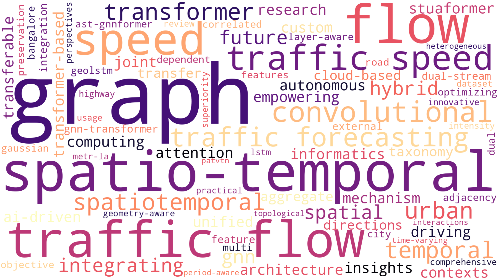
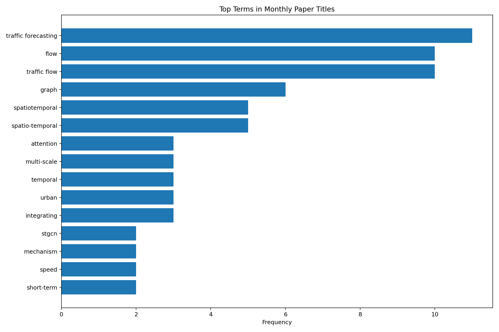
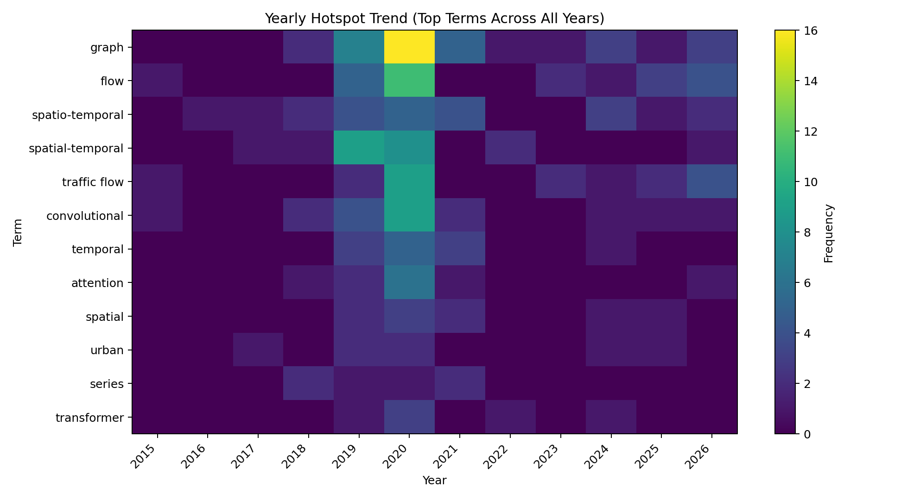
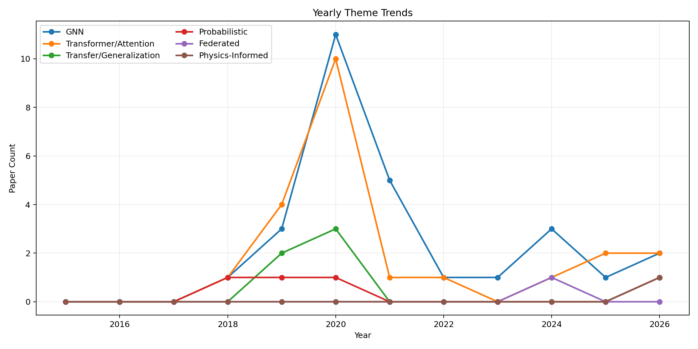

# 交通流预测资源汇总

英文版：[README.md](./README.md)

[![Forks][forks-shield]][forks-url]
[![Stargazers][stars-shield]][stars-url]

本仓库汇总交通流预测相关资源，包括论文、数据集、教程、工具库与相关仓库等。

## 重点可视化

最新月度论文标题词云：

最新 Top-K 术语频次图：

按年份热点对比图：

按年份主题线图：

<!-- START doctoc generated TOC please keep comment here to allow auto update -->
<!-- DON'T EDIT THIS SECTION, INSTEAD RE-RUN doctoc TO UPDATE -->

- [0x00 论文](#0x00-论文)
  - [综述](#综述)
  - [基于深度学习的交通预测方法](#基于深度学习的交通预测方法)
  - [重点整理（近年）](#重点整理近年)
  - [基于统计的交通预测方法](#基于统计的交通预测方法)
  - [时间序列预测](#时间序列预测)
  - [时序网络嵌入](#时序网络嵌入)
- [0x01 教程](#0x01-教程)
  - [教材](#教材)
  - [博客](#博客)
- [0x02 数据源](#0x02-数据源)
  - [数据集](#数据集)
  - [轨迹](#轨迹)
  - [ETA](#eta)
  - [网站](#网站)
- [0x03 工具库](#0x03-工具库)
- [0x04 会议与期刊](#0x04-会议与期刊)
- [0x05 研究团队](#0x05-研究团队)
  - [公司](#公司)
  - [高校](#高校)
- [0x06 相关仓库](#0x06-相关仓库)
- [0x07 基准与评测](#0x07-基准与评测)
  - [基准矩阵](#基准矩阵)
  - [自动趋势可视化](#自动趋势可视化)
- [贡献](#贡献)

<!-- END doctoc generated TOC please keep comment here to allow auto update -->

## 0x00 论文

### 综述

1. [TITS 2015] Traffic Flow Prediction With Big Data: A Deep Learning Approach [[paper]](https://bookdown.org/amanas/traficomadrid/docs/Traffic%20flow%20prediction%20with%20big%20data%20-%20A%20deep%20learning%20approach.pdf)
2. [KDD 2020] Deep Learning for Spatio-Temporal Data Mining: A Survey [[paper]](https://ieeexplore.ieee.org/abstract/document/9204396/)
3. [Information Fusion 2020] Urban flow prediction from spatiotemporal data using machine learning: A survey [[paper]](https://www.sciencedirect.com/science/article/pii/S1566253519303094)
4. [Arxiv 2020] Deep Learning on Traffic Prediction: Methods, Analysis and Future Directions [[paper]](https://arxiv.org/abs/2004.08555)
5. [Arxiv 2021] Graph Neural Network for Traffic Forecasting:  A Survey [[paper]](https://arxiv.org/abs/2101.11174)
6. [Applied Intelligence 2022] Spatial-temporal graph neural network for traffic forecasting: An overview and open research issues [[paper]](https://link.springer.com/content/pdf/10.1007/s10489-021-02587-w.pdf)

### 基于深度学习的交通预测方法

#### 2015

1. [NIPS 2015] Convolutional LSTM Network: A Machine Learning Approach for Precipitation Nowcasting [[paper]](https://papers.nips.cc/paper/2015/file/07563a3fe3bbe7e3ba84431ad9d055af-Paper.pdf)

#### 2016

1. [Sigspatial 2016] DNN-Based Prediction Model for Spatio-Temporal Data [[paper]](https://www.microsoft.com/en-us/research/wp-content/uploads/2016/09/DeepST-SIGSPATIAL2016.pdf) [[code]](https://arxiv.org/pdf/1610.00081.pdf)

#### 2017

1. [AAAI 2017] Deep Spatio-Temporal Residual Networks for Citywide Crowd Flows Prediction [[paper]](https://arxiv.org/pdf/1610.00081.pdf)
2. [ISPRS 2017] Road2Vec: Measuring Traffic Interactions in Urban Road System from Massive Travel Routes [[paper]](https://www.mdpi.com/2220-9964/6/11/321)
3. [Arxiv 2017] DeepTransport: Learning Spatial-Temporal Dependency for Traffic Condition Forecasting [[paper]](https://arxiv.org/pdf/1709.09585.pdf)

#### 2018

1. [TITS 2019] T-GCN: A Temporal Graph Convolutional Network for Traffic Prediction [[paper]](https://arxiv.org/pdf/1811.05320v3.pdf) [[code]](https://github.com/lehaifeng/T-GCN)
2. [TITS 2018] Missing Value Imputation for Traffic-Related Time Series Data Based on a Multi-View Learning Method [[paper]](https://ieeexplore.ieee.org/abstract/document/8478191)
3. [IJCAI 2018] Spatio-Temporal Graph Convolutional Networks: A Deep Learning Framework for Traffic Forecasting [[paper]](https://www.ijcai.org/Proceedings/2018/0505.pdf) [[code]](https://paperswithcode.com/paper/spatio-temporal-graph-convolutional-networks) [[review]](https://openreview.net/forum?id=SkNeyVzOWB)
4. [IJCAI 2018] LC-RNN: A Deep Learning Model for Traffic Speed Prediction [[paper]](https://www.ijcai.org/Proceedings/2018/482)
5. [IJCAI 2018] GeoMAN: Multi-level Attention Networks for Geo-sensory Time Series Prediction [[paper]](https://www.ijcai.org/Proceedings/2018/0476.pdf)
6. [ICLR 2018] Diffusion Convolutional Recurrent Neural Network: Data-Driven Traffic Forecasting [[paper]](https://arxiv.org/abs/1707.01926) [[code-official-tf]](https://github.com/liyaguang/DCRNN) [[code-pytorch]](https://github.com/xlwang233/pytorch-DCRNN) [[review]](https://openreview.net/forum?id=SJiHXGWAZ) [[data]](https://drive.google.com/drive/folders/10FOTa6HXPqX8Pf5WRoRwcFnW9BrNZEIX?usp=drive_open)
7. [KDD 2018] Hetero-ConvLSTM: A Deep Learning Approach to Traffic Accident Prediction on Heterogeneous Spatio-Temporal Data [[paper]](https://www.kdd.org/kdd2018/accepted-papers/view/hetero-convlstm-a-deep-learning-approach-to-traffic-accident-prediction-on-)
8. [CS224W 2018] Efficient Traffic Forecasting With Graph Embedding [[paper]](http://snap.stanford.edu/class/cs224w-2018/reports/CS224W-2018-42.pdf) [[code]](https://github.com/syin3/cs224w-traffic)
9. [CVPR 2018] Social GAN: Socially Acceptable Trajectories with Generative Adversarial Networks [[paper]](https://arxiv.org/abs/1803.10892) [[paper-ieee]](https://ieeexplore.ieee.org/document/8578338) [[code]](https://github.com/agrimgupta92/sgan)
10. [AAAI 2018] Deep Multi-View Spatial-Temporal Network for Taxi Demand Prediction [[paper]](https://ojs.aaai.org/index.php/AAAI/article/view/11836) [[code]](https://github.com/huaxiuyao/DMVST-Net) [[data]](https://outreach.didichuxing.com/appEn-vue/Personal)
11. ...

#### 2019

1. [TITS 2019] TrafficGAN: Network-Scale Deep Traffic Prediction With Generative Adversarial Nets [[paper]](https://ieeexplore.ieee.org/document/8935152)
2. [TITS 2019] Contextualized Spatial–Temporal Network for Taxi Origin-Destination Demand Prediction [[paper]](https://ieeexplore.ieee.org/abstract/document/8720246) [[code]](https://github.com/liulingbo918/CSTN)
3. [TITS 2019] Deep Spatial-Temporal 3D Convolutional Neural Networks for Traffic Data Forecasting [[paper]](https://ieeexplore.ieee.org/document/8684259)
4. [IJCAI 2019] Graph WaveNet for Deep Spatial-Temporal Graph Modeling [[paper]](https://www.ijcai.org/Proceedings/2019/0264.pdf) [[code]](https://github.com/nnzhan/Graph-WaveNet)
5. [IJCAI 2019] GSTNet: Global Spatial-Temporal Network for Traffic Flow Prediction [[paper]](https://www.aminer.cn/pub/5d4d46fb3a55acff992fdb8a/gstnet-global-spatial-temporal-network-for-traffic-flow-prediction?s=social)
6. [AAAI 2019] Revisiting Spatial-Temporal Similarity: A Deep Learning Framework for Traffic Prediction [[paper]](https://arxiv.org/pdf/1803.01254v2.pdf) [[code]](https://github.com/tangxianfeng/STDN)
7. [AAAI 2019] DeepSTN+: Context-aware Spatial-Temporal Neural Network for Crowd Flow Prediction in Metropolis [[paper]](https://ojs.aaai.org//index.php/AAAI/article/view/3892) [[code]](https://github.com/FIBLAB/DeepSTN)
8. [AAAI 2019] Attention Based Spatial-Temporal Graph Convolutional Networks for Traffic Flow Forecasting [[paper]](https://aaai.org/ojs/index.php/AAAI/article/view/3881) [[code-pytorch]](https://github.com/guoshnBJTU/ASTGCN-r-pytorch)
9. [AAAI 2019] Multi-Range Attentive Bicomponent Graph Convolutional NetworkforTraicForecasting [[paper]](https://arxiv.org/abs/1911.12093)
10. [WWWC 2019] Learning from Multiple Cities: A Meta-Learning Approach for Spatial-Temporal Prediction [[paper]](https://dl.acm.org/doi/abs/10.1145/3308558.3313577)
11. [IWPHM 2019] Spatio-Temporal Clustering of Traffic Data with Deep Embedded Clustering [[paper]](https://dl.acm.org/doi/abs/10.1145/3356995.3364537)
12. [ICCV 2019] STGAT: Modeling Spatial-Temporal Interactions for Human Trajectory Prediction [[paper]](https://openaccess.thecvf.com/content_ICCV_2019/html/Huang_STGAT_Modeling_Spatial-Temporal_Interactions_for_Human_Trajectory_Prediction_ICCV_2019_paper.html) [[code]](https://github.com/huang-xx/STGAT)
13. [KDD 2019] Urban Traffic Prediction from Spatio-Temporal Data Using Deep Meta Learning [[paper]](https://dl.acm.org/doi/abs/10.1145/3292500.3330884)[[code]](https://github.com/panzheyi/ST-MetaNet)
14. [ICIKM 2019] Matrix Factorization for Spatio-Temporal Neural Networks with Applications to Urban Flow Prediction [[paper]](https://dl.acm.org/doi/abs/10.1145/3357384.3357832)
15. [TKDE 2019] Flow prediction in spatio-temporal networks based on multitask deep learning [[paper]](https://ieeexplore.ieee.org/document/8606218)
16. [IJGIS 2019] Traffic speed prediction for intelligent transportation system based on a deep feature fusion model [[paper]](https://www.tandfonline.com/doi/abs/10.1080/15472450.2019.1583965?journalCode=gits20)
17. [Access 2019] Spatial-Temporal Graph Attention Networks: A Deep Learning Approach for Traffic Forecasting [[paper]](https://ieeexplore.ieee.org/document/8903252)
18. [Arxiv 2019] Forecaster: A graph transformer for forecasting spatial and time dependent data [[paper]](https://arxiv.org/abs/1909.04019)
19. [Arxiv 2019] Temporal fusion transformers for interpretable multi-horizon time series forecasting [[paper]](https://arxiv.org/abs/1912.09363)
20. ……

#### 2020

1. [Arxiv 2020] Spatial-Temporal Transformer Networks for Traffic Flow Forecasting [[paper]](https://arxiv.org/abs/2001.02908) [[code-not-official]](https://github.com/wubin5/STTN)
2. [Arxiv 2020] Transfer Learning with Graph Neural Networks for Short-Term Highway Traffic Forecasting [[paper]](https://arxiv.org/abs/2004.08038) [[code]](https://github.com/tanwimallick/TL-DCRNN)
3. [Arxiv 2020] Bayesian Spatio-Temporal Graph Convolutional Network for Traffic Forecasting [[paper]](https://www.researchgate.net/publication/344678512_Bayesian_Spatio-Temporal_Graph_Convolutional_Network_for_Traffic_Forecasting)
4. [TGIS 2020] Traffic transformer: Capturing the continuity and periodicity of time series for traffic forecasting [[paper]](https://onlinelibrary.wiley.com/doi/abs/10.1111/tgis.12644)
5. [ICTON 2020] Traffic Prediction in Optical Networks Using Graph Convolutional Generative Adversarial Networks [[paper]](https://ieeexplore.ieee.org/document/9203477)
6. [AAAI 2020] Spatio-Temporal Graph Structure Learning for Traffic Forecasting [[paper]](https://ojs.aaai.org//index.php/AAAI/article/view/5470) [[SOTA]](https://paperswithcode.com/paper/spatio-temporal-graph-structure-learning-for)
7. [AAAI 2020] Learning Geo-Contextual Embeddings for Commuting Flow Prediction [[paper]](https://ojs.aaai.org//index.php/AAAI/article/view/5425)
8. [AAAI 2020] Spatial-Temporal Synchronous Graph Convolutional Networks: A New Framework for Spatial-Temporal Network Data Forecasting [[paper]](https://ojs.aaai.org/index.php/AAAI/article/view/5438) [[code]](https://github.com/Davidham3/STSGCN)
9. [Access 2020] STGAT: Spatial-Temporal Graph Attention Networks for Traffic Flow Forecasting [[paper]](https://ieeexplore.ieee.org/stamp/stamp.jsp?arnumber=9146162)
10. [Sensor 2020] City-Wide Traffic Flow Forecasting Using a Deep Convolutional Neural Network [[paper]](https://www.mdpi.com/1424-8220/20/2/421)
11. [Mobile Computing 2020] BuildSenSys: Reusing Building Sensing Data for Traffic Prediction with Cross-domain Learning [[paper]](https://ieeexplore.ieee.org/abstract/document/9018140)
12. [TKDE 2020] Spatio-Temporal Meta Learning for Urban Traffic Prediction [[paper]](https://ieeexplore.ieee.org/document/9096591)
13. [WC 2020] What is the Human Mobility in a New City: Transfer Mobility Knowledge Across Cities [[paper]](http://urban-computing.com/pdf/www1208tianfu.pdf)
14. [TITS 2020] Traffic Graph Convolutional Recurrent Neural Network: A Deep Learning Framework for Network-Scale Traffic Learning and Forecasting [[paper]](https://ieeexplore.ieee.org/document/8917706) [[code]](https://github.com/zhiyongc/Graph_Convolutional_LSTM)
15. [NeurIPS 2020] Adaptive Graph Convolutional Recurrent Network for Traffic Forecasting [[paper]](https://arxiv.org/abs/2007.02842) [[code]](https://github.com/LeiBAI/AGCRN)
16. [AAAI 2020] GMAN: A Graph Multi-Attention Network for Traffic Prediction [[paper]](https://arxiv.org/abs/1911.08415) [[code]](https://github.com/zhengchuanpan/GMAN)
17. [KDD 2020] ConSTGAT: Contextual Spatial-Temporal Graph Attention Network for Travel Time Estimation at Baidu Maps [[paper]](https://www.kdd.org/kdd2020/accepted-papers/view/constgat-contextual-spatial-temporal-graph-attention-network-for-travel-tim)
18. [KDD 2020] Preserving Dynamic Attention for Long-Term Spatial-Temporal Prediction [[paper]](https://arxiv.org/abs/2006.08849)
19. [TITS 2020] Temporal Multi-Graph Convolutional Network for Traffic Flow Prediction [[paper]](https://ieeexplore.ieee.org/document/9098104)
20. [TITS 2020] A Spatial-Temporal Attention Approach for Traffic Prediction [[paper]](https://www.researchgate.net/publication/340567373_A_Spatial-Temporal_Attention_Approach_for_Traffic_Prediction)
21. [TITS 2020] Traffic Flow Imputation Using Parallel Data and Generative Adversarial Networks [[paper]](https://ieeexplore.ieee.org/document/8699108)
22. [WWW 2020] Traffic Flow Prediction via Spatial Temporal Graph Neural Network [[paper]](https://dl.acm.org/doi/abs/10.1145/3366423.3380186)
23. [IJGIS 2020] Graph attention temporal convolutional network for traffic speed forecasting on road networks [[paper]](https://www.tandfonline.com/doi/abs/10.1080/21680566.2020.1822765?journalCode=ttrb20)
24. [Arxiv 2020] ST-GRAT: A Novel Spatio-temporal Graph Attention Network for Accurately Forecasting Dynamically Changing Road Speed [[paper]](https://arxiv.org/abs/1911.13181)
25. [IF 2020] Spatial Temporal Incidence Dynamic Graph Neural Networks for Traffic Flow Forecasting [[paper]](https://www.sciencedirect.com/science/article/abs/pii/S0020025520300451?via%3Dihub)
26. [ICDM 2020] TSSRGCN: Temporal Spectral Spatial Retrieval Graph Convolutional Network  for Traffic Flow Forecasting [[paper]](https://ieeexplore.ieee.org/document/9338393)
27. ……

#### 2021

1. [Arxiv 2020] Spatial-Temporal Fusion Graph Neural Networks for Traffic Flow Forecasting [[paper]](https://arxiv.org/abs/2012.09641) [[code]](https://github.com/MengzhangLI/STFGNN)
2. [TITS 2021] Spatial‐temporal attention wavenet: A deep learning framework for traffic prediction considering spatial‐temporal dependencies [[paper]](https://ietresearch.onlinelibrary.wiley.com/doi/10.1049/itr2.12044) [[code]](https://paperswithcode.com/paper/spatial-temporal-attention-wavenet-a-deep#code)
3. [Arxiv 2021] Time Series is a Special Sequence: Forecasting with Sample Convolution and Interaction [[paper]](https://arxiv.org/pdf/2106.09305v2.pdf) [[code]](https://paperswithcode.com/paper/time-series-is-a-special-sequence-forecasting#code)
4. [KDD 2021] Dynamic Graph Convolutional Recurrent Network for Traffic Prediction: Benchmark and Solution [[paper]](https://dl.acm.org/doi/10.1145/3532611) [[code]](https://github.com/tsinghua-fib-lab/Traffic-Benchmark)
5. [KDD 2021] Dynamic and Multi-faceted Spatio-temporal Deep Learning for Traffic Speed Forecasting [[paper]](https://dl.acm.org/doi/abs/10.1145/3447548.3467275)
6. [AAAI 2021] TS2Vec: Towards Universal Representation of Time Series [[paper]](https://www.aaai.org/AAAI22Papers/AAAI-8809.YueZ.pdf)
7. [Arxiv 2021] Spatio-temporal joint graph convolutional networks for traffic forecasting [[paper]](https://arxiv.org/abs/2111.13684)
8. [PAKDD 2021] SST-GNN: Simplified Spatio-temporal Traffic forecasting model using Graph Neural Network [[paper]](https://arxiv.org/abs/2104.00055)
9. [IJCNN 2021] Unified Spatio-Temporal Modeling for Traffic Forecasting using Graph Neural Network [[paper]](https://arxiv.org/abs/2104.12518)
10. ……

#### 2022

1. [TITS 2022] 2F-TP:Learning Flexible Spatiotemporal Dependency for Flexible Traffic Prediction. [[paper]](https://ieeexplore.ieee.org/abstract/document/9703274/)
2. [Arxiv 2022] Pre-training Enhanced Spatial-temporal Graph Neural Network
   for Multivariate Time Series Forecasting [[paper]](https://arxiv.org/pdf/2206.09113.pdf)
3. [Arxiv 2022] A Lightweight and Accurate Spatial-Temporal Transformer for Traffic Forecasting [[paper]](https://arxiv.org/pdf/2201.00008.pdf)

#### 2023

1. [Arxiv 2023] Adaptive Graph Convolution Networks for Traffic Flow Forecasting [[paper]](https://arxiv.org/abs/2307.05517) [[code]](https://github.com/zhengdaoli/AGC-net)
2. [ICDE 2023] Dynamic Hypergraph Structure Learning for Traffic Flow Forecasting [[paper]](https://arxiv.org/abs/2309.12028)

#### 2024

1. [Arxiv 2024] UniST: A Prompt-Empowered Universal Model for Urban Spatio-Temporal Prediction [[paper]](https://arxiv.org/abs/2402.11838)
2. [Arxiv 2024] COOL: A Conjoint Perspective on Spatio-Temporal Graph Neural Network for Traffic Forecasting [[paper]](https://arxiv.org/abs/2403.01091)
3. [Complex & Intelligent Systems 2024] Generalized spatial–temporal regression graph convolutional transformer for traffic forecasting [[paper]](https://link.springer.com/article/10.1007/s40747-024-01578-x)
4. [ISPRS IJGI 2024] Traffic Flow Prediction Based on Federated Learning and Spatio-Temporal Graph Neural Networks [[paper]](https://www.mdpi.com/2220-9964/13/6/210)

<!-- START AUTO RECENT PAPERS -->
#### 2025

1. [Arxiv 2025] GraphSparseNet: a Novel Method for Large Scale Trafffic Flow Prediction [[paper]](https://arxiv.org/abs/2502.19823)
2. [Arxiv 2025] Embedding spatial context in urban traffic forecasting with contrastive pre-training [[paper]](https://arxiv.org/abs/2503.14980) [[code]](https://github.com/mattchrlw/forecasting-on-new-roads)
3. [Sensors 2025] An Adaptive Spatio-Temporal Traffic Flow Prediction Using Self-Attention and Multi-Graph Networks [[paper]](https://www.mdpi.com/1424-8220/25/1/282)
4. [Neural Computing and Applications 2025] Short-term multi-step-ahead sector-based traffic flow prediction based on the attention-enhanced graph convolutional LSTM network (AGC-LSTM) [[paper]](https://link.springer.com/article/10.1007/s00521-024-09827-3)

#### 2026

1. [Neural Networks 2026] Adaptive dynamic spatial-temporal graph convolutional neural network for traffic flow prediction [[paper]](https://www.sciencedirect.com/science/article/abs/pii/S0893608025014108)
2. [Electronics 2026] Dynamic Graph Information Bottleneck for Traffic Prediction [[paper]](https://doi.org/10.3390/electronics15030623)
3. [Scientific Reports 2026] 6G conditioned spatiotemporal graph neural networks for real time traffic flow prediction [[paper]](https://doi.org/10.1038/s41598-025-32795-0)
4. [Arxiv 2026] PIMCST: Physics-Informed Multi-Phase Consensus and Spatio-Temporal Few-Shot Learning for Traffic Flow Forecasting [[paper]](https://doi.org/10.48550/arxiv.2602.01936)
5. [Expert Systems with Applications 2026] HySRD-Net: Hybrid spectral residual diffusion on spatio-temporal graphs for probabilistic traffic forecasting [[paper]](https://doi.org/10.1016/j.eswa.2026.131214)
6. [PLoS ONE 2026] Feature-enhanced iTransformer: A two-stage framework for high-accuracy long-horizon traffic flow forecasting [[paper]](https://doi.org/10.1371/journal.pone.0340389)
7. [IET Intelligent Transport Systems 2026] A Novel Attention-Weighted VMD-LSSVM Model for High-Accuracy Short-Term Traffic Prediction [[paper]](https://doi.org/10.1049/itr2.70144)
8. [Electronics 2026] Multi-Scale Graph-Decoupling Spatial-Temporal Network for Traffic Flow Forecasting in Complex Urban Environments [[paper]](https://doi.org/10.3390/electronics15030495)
9. [Systems 2026] PDR-STGCN: An Enhanced STGCN with Multi-Scale Periodic Fusion and a Dynamic Relational Graph for Traffic Forecasting [[paper]](https://doi.org/10.3390/systems14010102)
10. [Lecture Notes in Computer Science 2026] STVMamba: A Spatio-Temporal-Variable Modeling Network with Selective State Space Mechanism for Long-Horizon Traffic Forecasting [[paper]](https://doi.org/10.1007/978-981-95-5761-5_18)
11. [Electronics 2026] TSAformer: A Traffic Flow Prediction Model Based on Cross-Dimensional Dependency Capture [[paper]](https://doi.org/10.3390/electronics15010231)
<!-- END AUTO RECENT PAPERS -->

### 重点整理（近年）

该小节将近三年交通流预测论文按任务和方法标签做结构化整理，便于快速筛选与对比。
方法标签为便于检索的轻量人工标注。

<!-- START AUTO CURATED DIGEST TABLE -->
| 年份 | 论文 | 任务 | 方法标签 | 代码 | 备注 |
| --- | --- | --- | --- | --- | --- |
| 2024 | [UniST](https://arxiv.org/abs/2402.11838) | 城市时空预测 | Prompting, Foundation Model | N/A | 偏通用模型与提示式框架 |
| 2024 | [COOL](https://arxiv.org/abs/2403.01091) | 交通预测 | STGNN, Graph Modeling | N/A | 联合视角的 STGNN 建模 |
| 2024 | [GSTRGCT](https://link.springer.com/article/10.1007/s40747-024-01578-x) | 交通预测 | Transformer, GCN | N/A | 回归与图 Transformer 结合 |
| 2024 | [FL + STGNN](https://www.mdpi.com/2220-9964/13/6/210) | 交通流预测 | Federated Learning, STGNN | N/A | 联邦学习场景下的时空图建模 |
| 2025 | [GraphSparseNet](https://arxiv.org/abs/2502.19823) | 大规模交通流预测 | Graph Sparsification, Efficiency | N/A | 面向大规模和高效率 |
| 2025 | [Contrastive Pre-training](https://arxiv.org/abs/2503.14980) | 城市交通预测 | Contrastive Learning, Transfer | [code](https://github.com/mattchrlw/forecasting-on-new-roads) | 强调跨道路泛化能力 |
| 2025 | [ASTAM + Multi-Graph](https://www.mdpi.com/1424-8220/25/1/282) | 交通流预测 | Self-Attention, Multi-Graph | N/A | 自适应时空建模 |
| 2026 | [AD-STGCN](https://www.sciencedirect.com/science/article/abs/pii/S0893608025014108) | 交通流预测 | Dynamic Graph, STGCN | N/A | 自适应动态图时空卷积 |
| 2026 | [Dynamic Graph Information Bottleneck](https://doi.org/10.3390/electronics15030623) | 交通预测 | Information Bottleneck, Dynamic Graph | N/A | 动态图表示压缩思路 |
| 2026 | [PIMCST](https://doi.org/10.48550/arxiv.2602.01936) | 交通流预测 | Physics-Informed Learning, Few-shot | N/A | 偏少样本迁移能力 |
| 2026 | [HySRD-Net](https://doi.org/10.1016/j.eswa.2026.131214) | 概率交通预测 | Probabilistic Forecasting, Graph Diffusion | N/A | 不确定性建模导向 |
| 2026 | [Feature-enhanced iTransformer](https://doi.org/10.1371/journal.pone.0340389) | 长时域交通流预测 | Transformer, Long-Horizon | N/A | 两阶段长预测框架 |
<!-- END AUTO CURATED DIGEST TABLE -->

### 基于统计的交通预测方法

#### 2018

1. [TITS 2018] Probabilistic Data Fusion for Short-Term Traffic Prediction With Semiparametric Density Ratio Model [[paper]](https://ieeexplore.ieee.org/document/8479367)

#### 2019

1. [TRPET 2019] A generalized Bayesian traffic model [[paper]](https://www.sciencedirect.com/science/article/pii/S0968090X18318199)

### 时间序列预测

1. [ICLR 2019] Context-aware Forecasting for Multivariate Stationary Time-series [[paper]](https://openreview.net/pdf?id=B1xHUiC5tm)
2. [Arxiv 2020] Informer: Beyond Efficient Transformer for Long Sequence Time-Series Forecasting [[paper]](https://arxiv.org/pdf/2012.07436.pdf) [[code]](https://github.com/zhouhaoyi/Informer2020)

### 时序网络嵌入

#### 2021

1. [KDD 2021] [Discrete-time Temporal Network Embedding via Implicit Hierarchical Learning in Hyperbolic Space](https://dl.acm.org/doi/abs/10.1145/3447548.3467422)

## 0x01 教程

### 教材

1. [Urban Computing](https://mitpress.mit.edu/books/urban-computing)
2. [Traffic Flow Dynamics: Data, Models and Simulation](https://link.springer.com/book/10.1007/978-3-642-32460-4)
3. [Transportation Network Analysis](https://link.springer.com/book/10.1007/978-1-4419-6142-6)
4. [Fundamentals of Transportation and Traffic Operations](https://www.elsevier.com/books/fundamentals-of-transportation-and-traffic-operations/garber/978-0-08-102671-7)
5. ……

### 博客

1. [Traffic prediction with advanced Graph Neural Networks](https://deepmind.com/blog/article/traffic-prediction-with-advanced-graph-neural-networks)
2. [LibCity Documentation (Quick Start)](https://libcity.ai/quick_start.html)
3. [LibCity Tutorials](https://libcity.ai/tutorials.html)
4. [DCRNN Official Repository](https://github.com/liyaguang/DCRNN)
5. [Traffic-Benchmark (KDD 2021)](https://github.com/tsinghua-fib-lab/Traffic-Benchmark)
6. [PyTorch Geometric Temporal Documentation](https://pytorch-geometric-temporal.readthedocs.io/en/latest/)
7. ……

## 0x02 数据源

### 数据集

#### Traffic Dataset in Non-China Region

1. [Cityscapes](https://www.cityscapes-dataset.com/login/)

2. [New York City](https://www.kaggle.com/c/nyc-taxi-trip-duration/overview)

3. [NYC Bike](https://www.citibikenyc.com/system-data)

4. [NYC Taxi](https://www.kaggle.com/c/nyc-taxi-trip-duration)

5. [Train Station Dataset](http://www.ee.cuhk.edu.hk/~xgwang/grandcentral.html)

6. [Apolloscape](http://apolloscape.auto/trajectory.html)
   
   该轨迹数据集由基于摄像头的图像、激光雷达扫描的点云和人工标注的轨迹组成。该数据集是在中国北京各种光照条件和交通密度下收集的。更具体地说，它包含了高度复杂的交通流，混合了车辆、乘客和行人。

7. [data.world.traffic](https://data.world/datasets/traffic)

8. [PEMS-SF Dataset From UCI](https://archive.ics.uci.edu/ml/datasets/PEMS-SF)
   
   每个属性都描述了测量站在一天中的某个时间戳记录的捕获器位置的占用率测量值（在0和1之间）。每个测站的ID在 stations_list文本文件中给出。更多关于每个测量站的位置(GPS, 公路, 方向)的信息请参考PEMS网站。每条记录有963个（站点）x144个（时间戳）=138.672个属性。

9. [Seattle Inductive Loop Detector Dataset](https://github.com/zhiyongc/Seattle-Loop-Data)

10. [Road location and traffic data](https://www.data.qld.gov.au/dataset/road-location-and-traffic-data)

11. [INRIX – Driving Intelligence](https://datarade.ai/data-providers/inrix/profile)
    
    Charged Data

12. [Los Angeles (METR-LA)](datasets/METR.md)

13. ……

#### Traffic Dataset in China

1. [百度开放数据](https://ai.baidu.com/broad/download?dataset=traffic)

2. [滴滴盖亚计划](https://outreach.didichuxing.com/)
   
   西安市脱敏路况预测数据，包括路网拓扑、道路属性、历史和实时车流等信息

3. [HZJTD](http://www.hzjtydzs.com/index2.html)

   杭州综合交通研究中心收集的数据，包括杭州主城区202条道路的交通状况、速度、拥堵指数。

#### Commute flow

1. [Longitudinal Employer-Household Dynamics](https://lehd.ces.census.gov/data/)
2. ……

#### Point of Interest/Land use

1. [PLUTO](https://www1.nyc.gov/site/planning/data-maps/open-data/dwn-pluto-mappluto.page)
   
   provide landuse data organized in .csv format, including more than 70 fields managed by city insititution.

2. ……

### 轨迹

### ETA

1. [深圳网约车行程轨迹数据-SIGSPATISL 2021 GISCUP 预估到达时间数据集](https://outreach.didichuxing.com/app-vue/DatasetProjectDetail?id=1028)

### 网站

1. [Welcome to PeMS](http://pems.dot.ca.gov)
2. ……

## 0x03 工具库

1. [Open Source Routing Machine](http://project-osrm.org)
2. [PyG Temporal](https://pytorch-geometric-temporal.readthedocs.io/en/latest/)
3. [LibCity](https://libcity.ai)
4. [OpenSTL](https://github.com/chengtan9907/OpenSTL)
5. [Traffic-Benchmark](https://github.com/tsinghua-fib-lab/Traffic-Benchmark)
6. [UrbanPy](https://github.com/EL-BID/urbanpy)

## 0x04 会议与期刊

1. ACM SIGSPATIAL SpatialDI
2. [IEEE Transactions on Intelligent Transportation Systems](https://ieeexplore.ieee.org/xpl/RecentIssue.jsp?punumber=6979)
3. [Association for the Advancement of Artificial Intelligence](https://www.aaai.org)

## 0x05 研究团队

### 公司

1. http://urban-computing.com/yuzheng
2. [DeepMind](https://deepmind.com/about/deepmind-for-google)
3. [Waymo Research](https://waymo.com/research/)
4. [百度 Apollo](https://apollo.auto/)
5. ……

### 高校

1. [北京交通大学 万怀宇老师团队](http://faculty.bjtu.edu.cn/8793/)
   
   Research Interest: Data mining and information extraction. e.g. Spatio-temporal data mining, social network mining, text information extraction and application of knowledge graph.
2. [清华大学 未来智能实验室 (FIB)](https://fi.ee.tsinghua.edu.cn/)
   
   方向：城市科学、时空建模与大规模 AI 系统。
3. [同济大学 ITS 研究中心（杨晓光团队）](https://itscenter.tongji.edu.cn/)
   
   方向：交通系统工程、交通控制、公共交通系统与智能交通。
4. [同济大学 STEP Lab（杜豫川团队）](https://steps.tongji.edu.cn/)
   
   方向：交通感知、交通基础设施智能化与交通 AI。
5. [中南大学 智能测控与信息技术研究所](https://stte.csu.edu.cn/info/1031/5767.htm)
   
   方向：交通系统感知、诊断与智能协同。
6. [中南大学 综合运输智能仿真与决策研究所](https://stte.csu.edu.cn/info/1031/5764.htm)
   
   方向：交通优化、仿真与数据驱动决策。
7. [西南交通大学 复杂交通系统智能设计实验室](https://idctslab.swjtu.edu.cn/)
   
   方向：复杂交通系统的数据驱动与人工智能方法。
8. [加州大学伯克利分校 交通研究所 (ITS)](https://its.berkeley.edu/)
   
   方向：交通系统分析、智能交通系统、交通运行与出行研究。
9. [加州大学伯克利分校 PATH](https://its.berkeley.edu/research-centers/path)
   
   方向：智能交通、车路协同与自动驾驶相关交通系统研究。
10. [麻省理工学院 Senseable City Lab](https://senseable.mit.edu/)
    
    方向：数据驱动城市计算、出行行为分析与实时城市感知。
11. [伦敦大学学院 CASA](https://www.ucl.ac.uk/casa)
    
    方向：城市分析、时空建模与计算城市科学。
12. [新加坡南洋理工大学 TRC](https://www.ntu.edu.sg/trc)
    
    方向：陆路交通系统、公共交通与数据驱动出行研究。

## 0x06 相关仓库

1. [paper with code](https://paperswithcode.com/task/traffic-prediction)

2. https://github.com/topics/traffic-prediction

3. [Awesome-Trajectory-Prediction](https://github.com/xuehaouwa/Awesome-Trajectory-Prediction)

4. [traffic_prediction](https://github.com/aprbw/traffic_prediction)

5. [transdim](https://github.com/xinychen/transdim)
   
   This project aim at provide accurate and efficient solution for spatio-temporal data prediction.

6. [城市数据派](https://www.udparty.com/index.php/lists/cases?page=0&keyword=交通)

7. [Multivariate Time Series Forecasting](https://paperswithcode.com/task/multivariate-time-series-forecasting/latest)

8. [deep-learning-time-series](https://github.com/Alro10/deep-learning-time-series)

9. [GNN paper](https://github.com/thunlp/GNNPapers#traffic-network)

10. [Discovering millions of datasets on the web](https://blog.google/products/search/discovering-millions-datasets-web/)

11. [LibCity](https://libcity.ai)
    An open-source research platform for intergrating several algorithms, data, and evalution metrics for traffic prediction.

12. [GNN4Traffic](https://github.com/jwwthu/GNN4Traffic)

13. [交通轨迹数据、工具、论文汇总](https://zhuanlan.zhihu.com/p/119425995)

14. [AGC-net](https://github.com/zhengdaoli/AGC-net)

15. [Forecasting on New Roads](https://github.com/mattchrlw/forecasting-on-new-roads)

16. ……

## 0x07 基准与评测

1. 任务定义：以短期交通流/速度预测为主，通常以多步预测（15/30/60 分钟）衡量模型的短时与中时性能。
2. 常用数据集：METR-LA、PEMS-BAY 是最常用的公开基准；建议标注时间粒度、采样周期、缺失率和空间覆盖范围。
3. 常用指标：MAE、RMSE、MAPE 为主；建议同时报告不同预测步长的指标，避免只给单一预测步。
4. 训练划分：按时间顺序划分训练/验证/测试，避免随机划分造成信息泄露。
5. 复现实验：建议提供随机种子、硬件信息、训练时长与参数规模，以便结果可复现。

### 基准矩阵

| 数据集 | 区域 | 预测信号 | 节点/传感器 | 时间粒度 | 常见预测步长 | 常用指标 | 划分方式 |
| --- | --- | --- | --- | --- | --- | --- | --- |
| METR-LA | 美国洛杉矶 | 交通速度 | 207 传感器 | 5 分钟 | 15/30/60 分钟 | MAE, RMSE, MAPE | 按时间顺序 |
| PEMS-BAY | 美国湾区 | 交通速度 | 325 传感器 | 5 分钟 | 15/30/60 分钟 | MAE, RMSE, MAPE | 按时间顺序 |
| NYC-Bike | 美国纽约 | 单车需求/行程 | 站点图 | 依论文设置 | 常见 30/60 分钟 | MAE, RMSE, MAPE | 按时间顺序 |
| NYC-Taxi | 美国纽约 | 出租车需求/OD | 区域图或网格 | 依论文设置 | 常见 30/60 分钟 | MAE, RMSE, MAPE | 按时间顺序 |

跨论文对比时建议统一指标定义与缺失值掩码策略。

### 自动趋势可视化

- 月度候选列表：`updates/monthly-paper-candidates.md`
- 词云与Top术语：`updates/wordcloud/`
- 年度热点与主题趋势：`updates/hotspots/`
- 生成流水线：`.github/workflows/monthly-paper-search.yml`（产物变化时自动提PR待人工审核）

## 贡献

贡献方式请参考 [这里](./CONTRIBUTION.md)

<!-- links -->

[forks-shield]: https://img.shields.io/github/forks/Coolgiserz/Awesome-Traffic-Prediction.svg?style=flat-square
[forks-url]: https://github.com/Coolgiserz/Awesome-Traffic-Prediction/network/members
[stars-shield]: https://img.shields.io/github/stars/Coolgiserz/Awesome-Traffic-Prediction.svg?style=flat-square
[stars-url]: https://github.com/Coolgiserz/Awesome-Traffic-Prediction/stargazers
