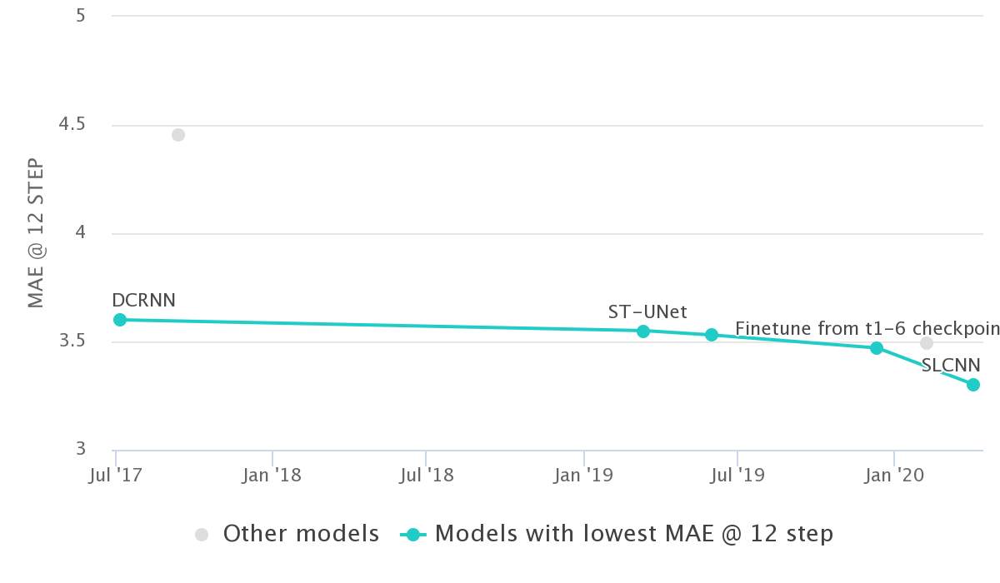

## Los Angeles (METR-LA)

#### Data Description

Los-loop。本数据集是在洛杉矶县的高速公路上通过环路检测器实时收集的。我们选取了2012年3月1日至3月7日期间的207个传感器及其交通速度。我们每5分钟汇总一次交通速度。相似性，数据总结出一个邻接矩阵和一个特征矩阵。邻接矩阵是由交通网络中传感器之间的距离计算出来的。由于Los-loop数据集包含一些缺失的数据，本文使用线性插值法来填补缺失值

#### SOTA: [Traffic Prediction on METR-LA](https://paperswithcode.com/sota/traffic-prediction-on-metr-la)

